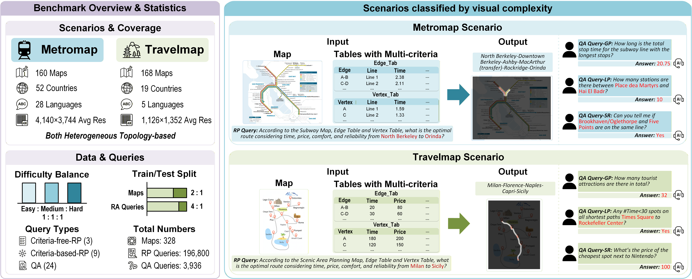

# MapTab: Complete Inference and Evaluation

[简体中文](README_zh.md)

**Official resources:** [Project page](https://ziqiao-shang.github.io/MapTab-Leaderboard/) · [arXiv paper](https://arxiv.org/abs/2602.18600) · [Hugging Face dataset](https://huggingface.co/datasets/szq-nju/MapTab) · [Official code](https://github.com/Ziqiao-Shang/MapTab)

This repository is an inference-only, reproducible implementation of **MapTab: A Diagnostic Benchmark for Long-Horizon Multi-Criteria Multimodal Reasoning on Heterogeneous Topological Graphs**. It follows the complete query-construction and scoring method in `MapTab-main` while covering both MetroMap and TravelMap, all QA and route-planning branches, CSV ablations, the released vertex2 task, and QA-guided planning.

The raw dataset and model weights are not committed here. Download MapTab from the [official Hugging Face dataset](https://huggingface.co/datasets/szq-nju/MapTab) and pass its root to the command line.



## Table of Contents

- [Overview](#overview)
- [Compatibility with MapTab-main](#compatibility-with-maptab-main)
- [Complete Task Inventory](#complete-task-inventory)
- [Dataset Layout](#dataset-layout)
- [Installation](#installation)
- [Quick Start](#quick-start)
- [Inference Backends](#inference-backends)
- [Evaluation](#evaluation)
- [Outputs and Resume Behavior](#outputs-and-resume-behavior)
- [Project Structure](#project-structure)
- [Reproducibility Checks](#reproducibility-checks)
- [Citation](#citation)

## Overview

MapTab tests whether a vision-language model can combine maps, JSON or CSV tables, and natural-language constraints to solve two families of tasks:

1. **Map question answering:** global counting, local counting, and spatial judgment over images, edge tables, vertex tables, or image-table combinations.
2. **Route planning:** shortest-path and weighted multi-criteria planning under time, price, comfort, and reliability constraints.

The implementation exposes 52 inference entries per domain-independent registry:

| Family | Count | Included settings |
| --- | ---: | --- |
| Scored QA | 22 | 12 original QA tasks, released task 13, and 9 CSV variants |
| Scored planning | 24 | 16 standard/ablation variants and 8 QA-guided variants |
| Serialization probes | 6 | JSON/CSV edge, vertex, and vertex2 table-only probes |
| **Total** | **52** | Every branch represented in the source query builders |

Run `maptab-infer list --json` to inspect the machine-readable registry.

## Compatibility with MapTab-main

The implementation was rebuilt from the complete workflow in `MapTab-main/MapTab-main`, especially `src/generate.py`, `src/metromap_utils.py`, `src/travelmap_utils.py`, `src/evaluate_qa.py`, and `src/evaluate_planning.py`.

The following benchmark behavior is preserved:

- The same source JSON file is selected for each domain and subtask.
- The complete MetroMap and TravelMap prompt sets are packaged with the code.
- Model input order follows the source builders: formatted task prompt, table labels and serialized tables, then the map image when required.
- JSON and CSV ablations use the same underlying examples.
- Constraint-specific edge/vertex columns are masked with separate MetroMap and TravelMap policies, matching the source logic.
- QA answers are accepted only from `<answer_begin>...<answer_end>` and compared numerically after rounding to two decimals.
- Planning routes use hyphen-separated stations, SequenceMatcher station similarity at threshold 0.5, strict transfer-station matching, prefix partial accuracy, and the original difficulty-score mapping.
- QA-guided planning preserves `<route_begin>...<route_end>` plus the four metric fields for total time, total price, average comfort, and average reliability.

The release also makes several operational repairs without changing the benchmark definition:

- Explicit `--data-root` replaces machine-specific `WORKSPACE_DIR` path concatenation.
- A declarative task registry replaces two long duplicated conditional builders.
- Hosted OpenAI-compatible APIs and in-process vLLM share the same input builder.
- Stable IDs, atomic writes, resume, error retention, and retry are built into generation.
- The released QA task 13 is registered. Because the release has no dedicated task-13 prompt, it uses the corresponding vertex-global prompt.
- Some TravelMap task-13 rows refer to unreleased `*_vertex2.json/.csv` assets. The loader preserves the source record but resolves the verified matching `*_vertex.json/.csv` asset when needed.
- The source query builders define eight QA-guided planning branches, but the provider-side column-routing code does not recognize their names. This implementation maps each branch to its matching constraint policy so all eight are executable.
- QA-guided outputs are normalized before route evaluation, and mixed result directories are evaluated by their recorded family rather than filename guesses.

## Complete Task Inventory

### QA Tasks

The 13 direct QA tasks are:

| Input | Global | Local | Spatial |
| --- | --- | --- | --- |
| Map image | `1_qa_only_pic_global` | `2_qa_only_pic_part` | `3_qa_only_pic_spatial_judge` |
| Edge JSON | `4_qa_edge_tab_global` | `5_qa_edge_tab_part` | `6_qa_edge_tab_spatial_judge` |
| Vertex JSON | `7_qa_vertex_tab_global` | `8_qa_vertex_tab_part` | `9_qa_vertex_tab_spatial_judge` |
| Map + vertex JSON | `10_qa_pic_and_tab_global` | `11_qa_pic_and_tab_part` | `12_qa_pic_and_tab_spatial_judge` |
| Released vertex2 JSON | `13_qa_vertex2_tab_global` | — | — |

The 9 scored CSV counterparts are:

- `4_csv_edge_global`, `5_csv_edge_part`, `6_csv_edge_spatial_judge`
- `7_csv_vertex_global`, `8_csv_vertex_part`, `9_csv_vertex_spatial_judge`
- `10_csv_and_pic_global`, `11_csv_and_pic_part`, `12_csv_and_pic_spatial_judge`

The six source-compatible serialization probes are `j_e_tab`, `j_v_tab`, `j_v2_tab`, `c_e_tab`, `c_v_tab`, and `c_v2_tab`. They send only the selected table representation and intentionally have no benchmark score. Use `all-probes` to run them; `all-qa` contains only scored QA tasks.

### Route-Planning Tasks

The 16 standard and ablation variants are:

| Group | Task names |
| --- | --- |
| Single/combined inputs | `shortest_path_only_map`, `shortest_path_only_tab`, `shortest_path_only_csv`, `shortest_path_map_and_tab_no_constraint`, `shortest_path_map_and_csv` |
| One constraint | `shortest_path_map_and_tab_with_constraint_1`, `shortest_path_map_and_tab_with_constraint_2`, `shortest_path_map_and_tab_with_constraint_3`, `shortest_path_map_and_tab_with_constraint_4` |
| Multiple constraints | `shortest_path_map_and_tab_with_constraint_1_2_3_4`, `shortest_path_map_and_tab_with_constraint_1_2_4`, `shortest_path_map_and_tab_with_constraint_1_3_4`, `shortest_path_map_and_tab_with_constraint_2_3_4` |
| Vertex2 and CSV | `only_vertex2`, `shortest_path_csv_vertex2`, `shortest_path_map_and_tab_csv_constraint_1_2_3_4` |

The constraint IDs retain the upstream meaning: 1 = time, 2 = price, 3 = comfort, and 4 = reliability. The input builder applies the exact domain-specific column policy before serialization.

The eight QA-guided planning variants are:

- `shortest_path_with_qa_and_constraint_1`
- `shortest_path_with_qa_and_constraint_2`
- `shortest_path_with_qa_and_constraint_3`
- `shortest_path_with_qa_and_constraint_4`
- `shortest_path_with_qa_and_constraint_1_2_3_4`
- `shortest_path_with_qa_and_constraint_1_2_4`
- `shortest_path_with_qa_and_constraint_1_3_4`
- `shortest_path_with_qa_and_constraint_2_3_4`

`all-planning` runs all 24 planning entries. `canonical-planning` excludes CSV and QA-guided ablations.

## Dataset Layout

The loader accepts both the original MapTab tree and the normalized Hugging Face package.

Original layout:

```text
DATA_ROOT/
├── metromap/
│   ├── data/{training_set,test_set,all}/
│   ├── qa_data/
│   ├── images/
│   └── tabulars/
└── travelmap/
    ├── data/{training_set,test_set,all}/
    ├── qa_data/
    ├── images/
    └── tabulars/
```

Normalized package layout:

```text
DATA_ROOT/
├── raw/
│   ├── metromap/{data,qa_data,prompts}/
│   └── travelmap/{data,qa_data,prompts}/
└── assets/
    ├── metromap/{images,tabulars}/
    └── travelmap/{images,tabulars}/
```

For exact inference, the CLI reads the original query records under `raw/` and resolves their referenced assets under `assets/`. It does not silently resample examples or rewrite answers.

## Installation

Python 3.10 or newer is required.

```bash
git clone <repository-url>
cd MapTab_git

python -m venv .venv
source .venv/bin/activate
python -m pip install --upgrade pip
python -m pip install -e .
```

For in-process local generation, install the optional vLLM dependency in an environment compatible with your CUDA stack:

```bash
python -m pip install -e ".[local]"
```

## Quick Start

### 1. Download and validate the dataset

```bash
maptab-infer download \
  --repo-id szq-nju/MapTab \
  --data-root ./data

maptab-infer validate \
  --data-root ./data \
  --domain all \
  --task all \
  --split test
```

Validation loads every selected source file, formats every required prompt, and resolves every referenced image/table before any paid or GPU inference begins.

### 2. Inspect the exact model input

```bash
maptab-infer inspect \
  --data-root ./data \
  --domain metromap \
  --task shortest_path_map_and_tab_with_constraint_1_2_3_4 \
  --split test \
  --index 0
```

This prints the ordered text/table/image content without calling a model.

## Inference Backends

### OpenAI-compatible API

```bash
export OPENAI_API_KEY=your_key_here

maptab-infer generate \
  --data-root ./data \
  --domain metromap \
  --task all-qa \
  --provider openai \
  --model qwen3-vl-plus \
  --base-url https://your-endpoint.example/v1 \
  --temperature 0 \
  --max-tokens 2048 \
  --output-dir results/response_generate
```

Use `--api-key-env NAME` if credentials are stored in a different environment variable. Keys are never accepted through a committed config file.

### In-process vLLM

```bash
maptab-infer generate \
  --data-root ./data \
  --domain travelmap \
  --task all-planning \
  --split test \
  --provider vllm \
  --model /path/to/multimodal-model \
  --tensor-parallel-size 4 \
  --max-model-len 128000 \
  --gpu-memory-utilization 0.9 \
  --output-dir results/response_generate
```

### Bash entry points

All Bash entry points reuse the same task registry and inference implementation. Configure the backend once:

```bash
export MAPTAB_DATA_ROOT=/path/to/MapTab
export MODEL_PATH=qwen3-vl-plus
export PROVIDER=openai
export OPENAI_API_KEY=your_key_here
export OPENAI_BASE_URL=https://your-endpoint.example/v1
```

The available scripts are:

| Scope | Script | Behavior |
| --- | --- | --- |
| Generic QA | `scripts/generate_qa.sh` | Runs `DOMAIN` (default `all`) and `QA_TASKS` (default `all-qa`) |
| Generic planning | `scripts/generate_rp.sh` | Runs `DOMAIN`, `RP_TASKS` (default `all-planning`), and `SPLIT` (default `test`) |
| MetroMap QA | `scripts/run_metromap_qa.sh` | Runs all scored MetroMap QA tasks, or the selector in `QA_TASKS` |
| TravelMap QA | `scripts/run_travelmap_qa.sh` | Runs all scored TravelMap QA tasks, or the selector in `QA_TASKS` |
| MetroMap planning | `scripts/run_metromap_planning.sh` | Runs all MetroMap planning tasks, or the selector in `RP_TASKS` |
| TravelMap planning | `scripts/run_travelmap_planning.sh` | Runs all TravelMap planning tasks, or the selector in `RP_TASKS` |
| One QA task | `scripts/run_qa_task.sh DOMAIN QA_TASK` | Runs one named QA task for one domain |
| One planning task | `scripts/run_planning_task.sh DOMAIN TASK [SPLIT]` | Runs one named planning task and split |
| All QA, positional API form | `scripts/run_all_qa.sh DATA_ROOT MODEL BASE_URL` | Runs both domains with an OpenAI-compatible endpoint |
| All planning, positional API form | `scripts/run_all_planning.sh DATA_ROOT MODEL BASE_URL [SPLIT]` | Runs both domains with an OpenAI-compatible endpoint |
| Complete generation | `scripts/run_all.sh` | Runs all scored QA and planning tasks sequentially |
| Evaluation | `scripts/evaluate_qa.sh`, `scripts/evaluate_rp.sh`, `scripts/evaluate_all.sh` | Evaluates QA, planning, or both result families |

Typical invocations are:

```bash
bash scripts/run_metromap_qa.sh
bash scripts/run_travelmap_planning.sh
bash scripts/run_qa_task.sh metromap 10_qa_pic_and_tab_global
bash scripts/run_planning_task.sh travelmap shortest_path_only_map test
bash scripts/run_all.sh
bash scripts/evaluate_all.sh
```

The generic scripts also expose `OUTPUT_DIR`, `API_KEY_ENV`, `TEMPERATURE`, `MAX_TOKENS`, `MAX_PIXELS`, `MAX_RETRIES`, `RETRY_BACKOFF`, `TIMEOUT`, `SEED`, `OFFSET`, and `LIMIT`. Set `OVERWRITE=1`, `RETRY_ERRORS=1`, or `CONTINUE_ON_ERROR=1` to enable the corresponding switches. For vLLM, set `PROVIDER=vllm` and optionally configure `TENSOR_PARALLEL_SIZE`, `MAX_MODEL_LEN`, and `GPU_MEMORY_UTILIZATION`.

The Python compatibility wrapper also accepts the original `--task`, `--subtask`, and `--model_path` names:

```bash
PYTHONPATH=src python src/generate.py \
  --task metromap \
  --subtask shortest_path_only_map \
  --model_path qwen3-vl-plus \
  --provider openai \
  --base_url https://your-endpoint.example/v1 \
  --data_root ./data
```

Useful task selectors are `all`, `all-qa`, `all-planning`, `all-probes`, `canonical-qa`, and `canonical-planning`. Planning supports `--split train|test|all`; QA and probes always use their released QA records.

## Evaluation

Evaluate one file with automatic family detection:

```bash
maptab-infer evaluate \
  --family auto \
  --input results/response_generate/metromap_1_qa_only_pic_global_MODEL_results.json
```

Evaluate a mixed directory:

```bash
maptab-infer evaluate-dir \
  --input-dir results/response_generate \
  --output-dir results_evaluate \
  --family auto
```

The metrics are:

| Family | Metrics |
| --- | --- |
| QA | Numeric `accuracy` after strict tag extraction and two-decimal rounding |
| Planning | `all_acc`, prefix `part_acc`, and `difficulty_score_total` |

The evaluator writes an item-level `*.evaluated.json` file and a machine-readable `*.summary.json` next to it in the selected evaluation directory.

## Outputs and Resume Behavior

Generation uses the source-compatible filename:

```text
{domain}_{subtask}_{model-name}_results.json
```

Each item preserves the complete source record and adds provenance and normalized generation fields:

```json
{
  "_id": "metromap:qa:1_qa_only_pic_global:test:000000",
  "_source_index": 0,
  "benchmark_domain": "metromap",
  "benchmark_task": "1_qa_only_pic_global",
  "benchmark_family": "qa",
  "benchmark_variant": "canonical",
  "benchmark_split": "test",
  "source_file": "...",
  "model": "qwen3-vl-plus",
  "raw_response": "<answer_begin>42<answer_end>",
  "response": "<answer_begin>42<answer_end>",
  "reasoning_content": null,
  "error": null
}
```

Writes are atomic. Existing successful IDs are skipped by default, `--retry-errors` reruns only failed items, and `--overwrite` starts that output file again. `--offset` and `--limit` support bounded runs.

## Project Structure

```text
MapTab_git/
├── assets/
│   └── fig_1.png
├── scripts/
│   ├── download_data.sh
│   ├── generate_qa.sh
│   ├── generate_rp.sh
│   ├── run_metromap_qa.sh
│   ├── run_travelmap_qa.sh
│   ├── run_metromap_planning.sh
│   ├── run_travelmap_planning.sh
│   ├── run_qa_task.sh
│   ├── run_planning_task.sh
│   ├── run_all_qa.sh
│   ├── run_all_planning.sh
│   ├── run_all.sh
│   ├── evaluate_qa.sh
│   ├── evaluate_rp.sh
│   └── evaluate_all.sh
├── src/
│   ├── generate.py
│   ├── evaluate_qa.py
│   ├── evaluate_planning.py
│   └── maptab_infer/
│       ├── cli.py
│       ├── data.py
│       ├── evaluate.py
│       ├── parsing.py
│       ├── providers.py
│       ├── runner.py
│       ├── tasks.py
│       └── prompts/{metromap,travelmap}/
├── tests/
│   └── test_registry.py
├── README.md
├── README_zh.md
└── pyproject.toml
```

## Reproducibility Checks

The following checks require no model API:

```bash
python -m compileall -q src tests
PYTHONPATH=src python -m unittest discover -s tests -v
bash -n scripts/*.sh

maptab-infer validate \
  --data-root /path/to/MapTab \
  --domain all \
  --task all \
  --split test
```

The test suite checks registry completeness, source-compatible filenames, domain-specific table masking, TravelMap vertex2 fallback, QA-guided parsing, and the original QA/planning metric behavior.

## Security and Release Scope

No raw MapTab dataset, model weights, historical responses, caches, or credentials are included. The code reads API credentials only from an environment variable. Before publishing results, retain the dataset revision, model identifier or checkpoint hash, decoding settings, prompt files, and generated raw responses.

## Citation

If you use MapTab in your research, please cite:

```bibtex
@article{shang2026maptab,
  title={MapTab: A Diagnostic Benchmark for Long-Horizon Multi-Criteria Multimodal Reasoning on Heterogeneous Topological Graphs},
  author={Shang, Ziqiao and Ge, Lingyue and Xu, Zian and Cheng, Zi-Jian and Tian, Shi-Yu and Huang, Zhenyu and Fu, Wenbo and Wu, Weiming and Chen, Yang and Zhang, Xiangwen and Hu, Yulan and Liu, Bin and Guo, Lan-Zhe},
  journal={arXiv preprint arXiv:2602.18600},
  year={2026}
}
```

## License

No standalone license file was present in the source snapshot used for this inference release. Add the intended code license before public redistribution. Dataset use is governed separately by the terms published with the official MapTab dataset.
