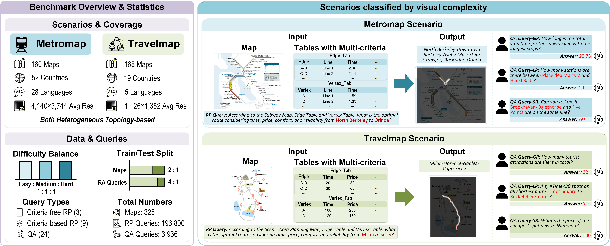

# MapTab: Are MLLMs Ready for Multi-Criteria Route Planning in Heterogeneous Graphs?

MapTab is a comprehensive benchmark designed to evaluate the map understanding and spatial reasoning capabilities of Vision-Language Models (VLMs). The benchmark focuses on two core tasks: **route planning** and **map-based question answering**, using both metro maps and travel maps.

**Project Page:** [https://ziqiao-shang.github.io/Ziqiao-Shang.github.io-MapTab/](https://ziqiao-shang.github.io/Ziqiao-Shang.github.io-MapTab/)



## 📋 Table of Contents

- [Overview](#overview)
- [Task Description](#task-description)
- [Dataset](#dataset)
- [Version Requirements](#version-requirements)
- [Quick Start](#quick-start)
- [Supported Models](#supported-models)
- [Project Structure](#project-structure)
- [Evaluation Metrics](#evaluation-metrics)
- [Citation](#citation)

## Overview

MapTab evaluates VLMs on their ability to:
1. **Understand map visualizations** - Parse and interpret visual map information
2. **Process tabular data** - Understand structured information in tables (JSON/CSV)
3. **Perform spatial reasoning** - Plan routes and answer spatial questions
4. **Follow complex constraints** - Handle multi-constraint route planning tasks

## Task Description

### 1. Route Planning Tasks

The benchmark includes various route planning subtasks with different input modalities and constraint levels:

| Subtask | Input Modality | Description |
|---------|---------------|-------------|
| `shortest_path_only_map` | Map Image | Route planning using only visual map |
| `shortest_path_only_tab` | Table (JSON) | Route planning using only tabular data |
| `shortest_path_only_csv` | Table (CSV) | Route planning using only CSV data (ablation) |
| `shortest_path_map_and_tab_no_constraint` | Map + Table | Combined input without constraints |
| `shortest_path_map_and_csv` | Map + CSV | Combined with CSV format (ablation) |
| `shortest_path_map_and_tab_with_constraint_1` | Map + Table | With constraint type 1 |
| `shortest_path_map_and_tab_with_constraint_2` | Map + Table | With constraint type 2 |
| `shortest_path_map_and_tab_with_constraint_3` | Map + Table | With constraint type 3 |
| `shortest_path_map_and_tab_with_constraint_4` | Map + Table | With constraint type 4 |
| `shortest_path_map_and_tab_with_constraint_1_2_3_4` | Map + Table | With all four constraints |
| `shortest_path_map_and_tab_with_constraint_1_2_4` | Map + Table | With constraints 1, 2, and 4 |
| `shortest_path_map_and_tab_with_constraint_1_3_4` | Map + Table | With constraints 1, 3, and 4 |
| `shortest_path_map_and_tab_with_constraint_2_3_4` | Map + Table | With constraints 2, 3, and 4 |
| `only_vertex2` | Map + Table | Special vertex subset task |
| `shortest_path_csv_vertex2` | Map + CSV | CSV format with vertex subset (ablation) |
| `shortest_path_map_and_tab_csv_constraint_1_2_3_4` | Map + CSV | CSV format with all constraints (ablation) |

### 2. Question Answering Tasks

QA tasks evaluate map comprehension across different aspects:

| Subtask ID | Task Type | Description |
|------------|-----------|-------------|
| 1 | `1_qa_only_pic_global` | Global questions using only map image |
| 2 | `2_qa_only_pic_part` | Local/partial questions using only map image |
| 3 | `3_qa_only_pic_spatial_judge` | Spatial judgment using only map image |
| 4 | `4_qa_edge_tab_global` | Global edge questions with table |
| 5 | `5_qa_edge_tab_part` | Local edge questions with table |
| 6 | `6_qa_edge_tab_spatial_judge` | Spatial edge judgment with table |
| 7 | `7_qa_vertex_tab_global` | Global vertex questions with table |
| 8 | `8_qa_vertex_tab_part` | Local vertex questions with table |
| 9 | `9_qa_vertex_tab_spatial_judge` | Spatial vertex judgment with table |
| 10 | `10_qa_pic_and_tab_global` | Global questions with map and table |
| 11 | `11_qa_pic_and_tab_part` | Local questions with map and table |
| 12 | `12_qa_pic_and_tab_spatial_judge` | Spatial judgment with map and table |

## Dataset

The dataset includes two map types:

- **MetroMap**: Synthetic metro/subway network maps
- **TravelMap**: Travel route maps with geographic information

### Dataset Status

The current release includes the following files under both `metromap/` and `travelmap/`:
- ✅ **`data/`** - Route Planning (RP) task test query set
- ✅ **`qa_data/`** - Question Answering (QA) task query set
- ✅ **`images/`** - Map images
- ✅ **`prompts/`** - Prompt templates for both RP and QA tasks
- ✅ **`tabulars/`** - `Edge_tab` and `Vertex_tab` files

> **Note**: In the current release, only the RP task test query set is available. QA task queries and RP task training queries will be released in future updates.
>
> Files in these five folders (`data/`, `qa_data/`, `images/`, `prompts/`, `tabulars/`) can be downloaded from Hugging Face: [https://huggingface.co/datasets/szq-nju/MapTab](https://huggingface.co/datasets/szq-nju/MapTab)

## Version Requirements

### Runtime and Dependency Versions

- Python >= 3.8
- PyTorch >= 2.0
- OpenAI SDK (for API-based models)
- vLLM (for local model inference)
- NumPy

## Quick Start

### 1. Set Environment Variables

```bash
export WORKSPACE_DIR="/path/to/MapTab"
export API_KEY="your-api-key"  # For API-based models
```

### 2. Run Generation

```bash
# Generate RP task results
bash scripts/generate_rp.sh

# Generate QA task results
bash scripts/generate_qa.sh
```

### 3. Run Evaluation

```bash
# Evaluate RP task results
bash scripts/evaluate_rp.sh

# Evaluate QA task results
bash scripts/evaluate_qa.sh
```

## Supported Models

The framework has been tested with the following model identifiers in `src/generate_lib/utils.py`:

### Local Models (via vLLM)

- `Qwen3-VL-8B-Instruct`
- `Qwen3-VL-8B-Thinking`
- `Qwen3-VL-30B-A3B-Thinking`
- `Qwen2.5-VL-7B-Instruct`
- `Kimi-VL-A3B-Thinking-2506`
- `Kimi-VL-A3B-Instruct`
- `Phi-4-multimodal-instruct`
- `Phi-3.5-vision-instruct`
- `Glyph`
- `Qwen3-VL-2B-Instruct`
- `llava-v1.6-mistral-7b-hf`
- `InternVL3_5-30B-A3B`
- `InternVL3_5-8B`
- `Ovis2.5-9B`

### API-Based Models

- `qwen3-vl-32b-instruct`
- `qwen3-vl-8b-instruct`
- `qwen3-vl-30b-a3b-instruct`
- `qwen3-vl-32b-thinking`
- `qwen3-vl-8b-thinking`
- `qwen3-vl-plus`
- `qwen3-max`
- `gpt-4.1`
- `gpt-5`
- `gpt-4o`
- `doubao-seed-1-6-251015`
- `kimi-latest`
- `GLM-4.1V-9B-Thinking`
- `GLM-4.6V`
- `step3`
- `Qwen3-VL-30B-A3B-Instruct`
- `gemini-1.5-pro-001`
- `gemini-1.0-pro-vision-001`
- `gemini-1.5-flash-001`
- `gemini-1.5-pro-exp-0801`
- `gemini-3-flash-preview`

> Note: For API-based models, we only provide one Aliyun Bailian integration example in `src/generate_lib/qwen_api.py`. Since API platforms vary, please implement other provider interfaces by following this example.

## Project Structure

```
MapTab/
├── src/
│   ├── generate.py            
│   ├── evaluate_planning.py    
│   ├── evaluate_qa.py           
│   ├── metromap_utils.py        
│   ├── travelmap_utils.py      
│   └── generate_lib/           
│       ├── qwen_api.py         
│       ├── utils.py            
│       └── vllm_LLMengine.py    
├── scripts/
│   ├── generate_rp.sh         
│   ├── generate_qa.sh         
│   ├── evaluate_rp.sh          
│   └── evaluate_qa.sh         
├── metromap/                  
│   ├── data/
│   │   └── test_set/          
│   ├── images/
│   ├── prompts/             
│   └── tabulars/
├── travelmap/                  
│   ├── data/
│   │   └── test_set/          
│   ├── images/
│   ├── prompts/              
│   └── tabulars/
├── results/                   
└── results_evaluate/          
```


## Evaluation Metrics

### Metrics

| Metric | Description |
|--------|-------------|
| **all_acc** | Exact match accuracy (complete route correctness) |
| **part_acc** | Partial accuracy (proportion of correct route segments) |
| **Difficulty_score** | Difficulty-weighted score based on map and query complexity |

### QA Task Metrics

| Metric | Description |
|--------|-------------|
| **accuracy** | Proportion of correct numeric answers |


## Citation

If you use MapTab in your research, please cite:

```bibtex
@article{shang2026maptab,
  title={MapTab: Can MLLMs Master Constrained Route Planning?},
  author={Shang, Ziqiao and Ge, Lingyue and Chen, Yang and Tian, Shi-Yu and Huang, Zhenyu and Fu, Wenbo and Li, Yu-Feng and Guo, Lan-Zhe},
  journal={arXiv preprint arXiv:2602.18600},
  year={2026}
}
```
